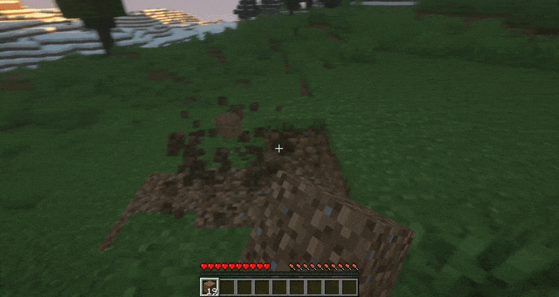
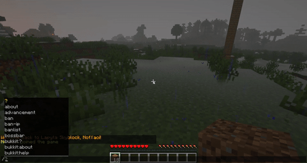

# Minecraft RPG Plugin

This plugin allows players to **gain XP** by breaking and placing blocks, killing mobs, and enchanting items! The gained XP does not affect Minecraft's built-in XP system but stands on its own.

Players can then **upgrade their skills**, so that they become faster, have more health, are stronger, have increased XP gain and are more endurant!

*Note for server owners: If you're interested in using this plugin on your server, you need to have an SQL database available. Provide the necessary information in the config.yaml file which will be generated after the first time you run your server with this plugin.*
